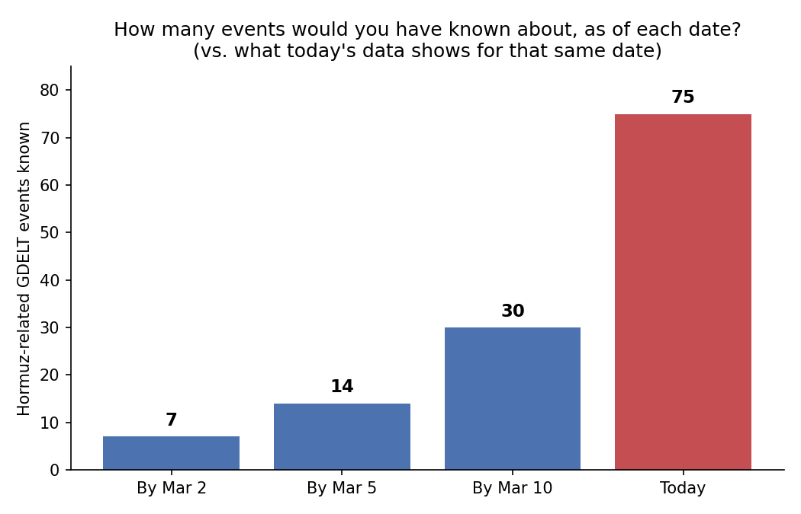

# Point-in-Time Data Integrity for Multi-Source Forecasting

## Why this matters

Imagine you're trying to predict what people would have believed about a product on March 1st. You open a news archive, but instead of reading only the articles that were available on March 1st, you use today's archive, where old articles have been updated, corrected, or supplemented with information that only became available months later. Your analysis may look historical, but you're actually giving yourself information that didn't exist at the time.

That's what happens when a forecasting model is trained by looking back at data
as it appears *today*, instead of as it actually looked on the day
it's being tested against. The model quietly gets to peek at the
future, and nobody notices, because it feels like normal historical
data.

For a company whose entire pitch is "we knew about this disruption
before anyone else," this matters a lot. If the way you measure your
own lead time accidentally lets your model see information from
*after* the moment you're claiming to have known something, your
"we called it 12 days early" number can end up flattering itself —
not because anyone lied, but because of how the check was done. A
customer, investor, or new hire doing diligence on that number would
be right to ask how it was measured.

## What this shows

Using a real, public data source (GDELT, a database of world news
events, chosen because it is structured the same general way as the
news, sanctions, and registry feeds a company like this would use),
this project asks a simple question about a real 2026 crisis in the
Strait of Hormuz: **how many related events had actually been
recorded as of a given date, versus how many does today's data show
for that same date?**

| Cutoff | Events known |
|---|---|
| By March 2 | 7 |
| By March 5 | 14 |
| By March 10 | 30 |
| Today | **75** |

If you used today's data to check what was "known" as of March 2,
you'd see 75 events — but only 7 had actually happened by then. That's
**about 10.7 times more than was really known at the time.** This is
the honest size of the mistake that happens when a query doesn't ask
"what did we know by this date," and instead asks "what do we know
now."

## How it's organized

- [`docs/PROBLEM.md`](docs/PROBLEM.md) — the problem, defined
  precisely, and what is in and out of scope.
- [`docs/DESIGN.md`](docs/DESIGN.md) — the minimal design that solves
  it, and the reasoning behind not reaching for a larger framework.
- [`docs/JOURNAL.md`](docs/JOURNAL.md) — a plain log of what was
  tried, what the data showed, and where the plan changed along the
  way.
- [`queries/`](queries) — the actual SQL used, in the order it was
  run.
- [`results/`](results) — the raw numbers and the chart above.

## The worked example

Ran two kinds of queries against GDELT's public BigQuery dataset: one
that finds real events tied to the Strait of Hormuz, and one that
counts how many of those events existed by a given cutoff date versus
how many exist in total today. The gap between those two counts is
the leak, shown concretely rather than assumed.

## How to run it

The queries in `queries/` are plain BigQuery SQL. They can be run
directly against GDELT's public dataset (`gdelt-bq.gdeltv2`) in the
BigQuery console — no setup or credentials beyond a free Google Cloud
account are required.

## Scope

This project does not attempt to replicate Ekho Labs' full data
pipeline. It uses one public, freely available data source to
demonstrate a general failure mode that applies to any system built
the way theirs is — real-time forecasting from many external sources.
It is an independent exercise, not a claim about how Ekho Labs' actual
system works.